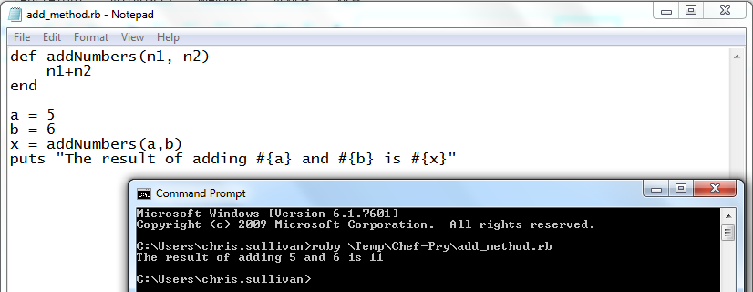
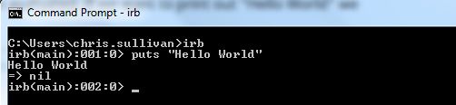
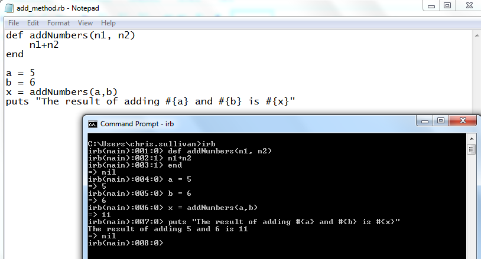
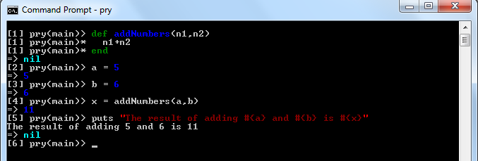
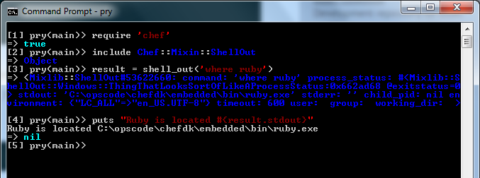
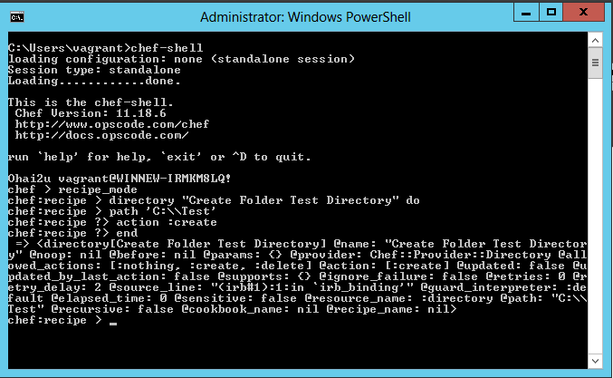
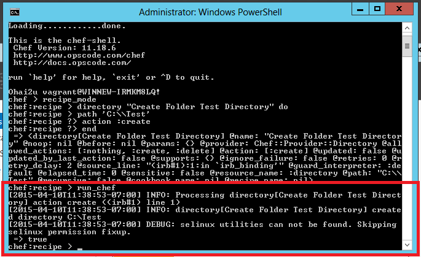
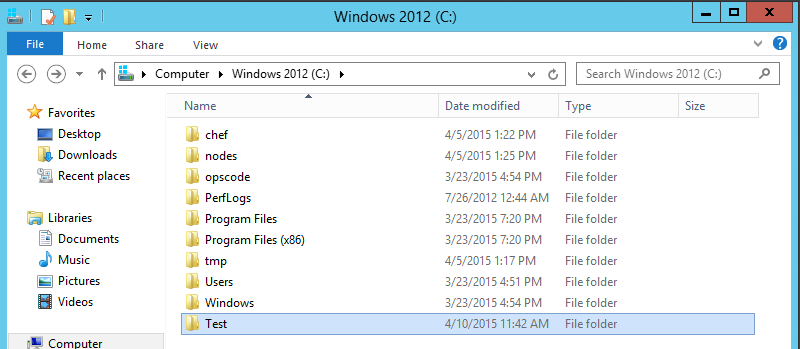

Debugging Chef Cookbooks
------------------------

As a novice Chef developer my development process was similar to the following

* Copy an existing cookbook
* Make some modifications to the resources contained in the Cookbook (or copy other similar resources)
* Work through the test / debug / fix cycle

How we test cookbooks
---------------------

Test kitchen is the preferred way to run and test cookbooks for developers, we use test kitchen in conjunction with Vagrant and Virtual Box, the process of testing the cookbook is called converging.

Ordinarily you don't have to worry about what is involved in test kitchen running it's converging process but using Vagrant and box files it is similar to the following

* Test kitchen will create a Vagrant file to configure Vagran
* Downloads a Virtual Box VM image (as a .box file)
* Unpack the contents of the box file
* Attach the Virtual Machine to VirtualBox
* Boot the Virtual Machine
* When the Virtual Machine has booted, download and install the relevant provisioner (Chef)
* Download and store all dependant cookbooks
* Create a tarbar of the cookbooks
* Transfer the tarball of cookbooks to the Virtual Machine
* Unpack the tarball of cookbooks on the Virtual Machine
* Initiate Chef client run based on the run list

The feedback cycle is normally at least five minutes. When you are a novice Chef developer the chances are that you will make mistakes configuring the Chef resources or writing Ruby code (re: plenty of runtime and syntax errors).
Debugging those resource then consists of adding Chef log resource to output the state of the environment and running a second converge, the entry point of the converging after the initial converge is from downloading and installing the relevant provisioner.

There has to be a better way!

Perfecting your Ruby code with IRB
----------------------------------
Making silly mistakes when writing Ruby code is frustrating, a good technique for testing your code befre including it in a cookbook could work like this

* Fire up your favourite text editor
* Write your Ruby code
* Save the file
* Go to a command prompt
* Use the Ruby program to run your script.

However you still may have to go through several iterations of code / test / debug.

Ruby (and ChefDK) are supplied with a variety of tools pre-packaged ready to use. One of the tools that I have come to use a lot is Interactive Ruby, to start interactive Ruby type irb in a command prompt.

Once Interactive Ruby (IRB) has loaded you are presented with a prompt, any command you type will come back with an immediate response.

Type: puts Hello World in IRB responds with Hello World but also => nil, the second line of the output is the return value for the method (or methods called), puts does not return anything hence the return value of nil.

With IRB you can create classes, methods, include libraries, in fact you can do anything that you can in Ruby.

Pry - An alternative to IRB
---------------------------
When looking for tools that would help show the internal working of Ruby (stack frames) I discovered a tool that is similar to Interactive Ruby called Pry. Pry is supplied as part of the Chef Client and ChefDK. If you have manually installed Ruby (not as part of the ChefDK) then you can install Pry with gem install pry.

To run Pry open a command prompt and type pry. The whole experience looks and feels similar to Interactive Ruby (IRB) but with much more power. Pry has various plug in modules that provide extra value (link: https://github.com/pry/pry/wiki/Available-plugins)

Pry and IRB can be used with the Chef library, below is a basic example of using Chef shell_out class to find the location of Ruby.

Perfecting individual Chef Resources with Chef Shell
----------------------------------------------------
We've now improved our feedback cycle with the Ruby code but when learning our new tool we might not be familiar with the other part of the syntax.

Chef is a Domain Specific Language (DSL) that works by creating definitions for resources, resources are things such as 
* Files
* Directories
* Installation packages ... etc

We need a way to get faster feedback when defining our Chef resources.

The Chef client (and ChefDK) comes with a similar tool to Interactive Ruby called chef-shell (link: https://docs.chef.io/chef_shell.html). Chef shell can be run on your developer machine but is more commonly run on the node you want to converge on, it is used to debug cookbooks in your nodes run list but can be used to create and test single Chef Resources.

Chef-Shell has a three different modes

Mode         | Description
------------ | -----------------------------------------------------------------------------
Standalone   | Default. No cookbooks are loaded, and the run list is empty.
Solo         | chef-shell acts as a chef-solo client. 
Client       | chef-shell acts as a chef-client.

**Solo Mode**
It attempts to load the chef-solo configuration file and JSON attributes. If the JSON attributes set a run list, it will be honored. Cookbooks will be loaded in 
the same way that chef-solo loads them. chef-solo mode is activated with the -s or --solo command line option, and JSON attributes are specified in the same way as for chef-solo, with -j /path/to/chef-solo.json

**Client Mode**
 During startup, it reads the chef-client configuration file and contacts the Chef server to get attributes and cookbooks. The run list will be set in the same way as normal chef-client runs. chef-client mode is activated with the -z or --client options. You can also specify the  configuration file with -c CONFIG and the server URL with -S SERVER_URL

In order to write and test resources we can use Chef-Shell in standalone mode.

From a command prompt type chef-shell, chef-shell prompt will be displayed. When running Chef-shell has various different modes, to test a resource you need to switch to recipe mode. At the prompt define your resource, remember you can store a reference to the resource in a local variable, very helpful when you want to change one or two attributes without having to re-declare the resource.

When you have finished designing your resource Chef-shell will echo back all of the attribute settings.

In order to perform a Converge and test your resource simply type run_chef; if there are any problems with the definition they will be displayed now otherwise the actions on resources will be carried out.

Just to prove that the resource has successfully converged lets make sure our folder has been created

Sometimes when things are not working as expected you will need to login to the VM and dig a little deeper, the two main techniques I use for debugging are described in the sub folders. 

There is also another debugging aid for Cookbook development, https://rubygems.org/gems/kitchen-binding but unfortunately I could not run this as successfully as the other techniques.

Pry can be used in conjunction with Chef-Shell or Chef-Apply and is probably one of the best tools in your Ruby toolbox.
